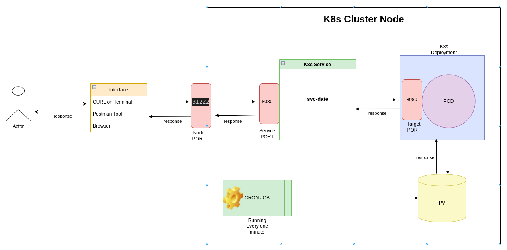

# README 
## Last 5 Jobs - Date & Time App - K8s Project - NodeJS

## Assumptions:
### 1. default Namespace is considered here for all K8s object creation
### 2. If we wish to change & create a new namespace then all       subsequent commands will have to append with " -n new-namespace "
### 3. kubectl Client Version: v1.24.3

#### NOTE: If we use old kubectl version, then cron job will not work as batch/v1 K8s APIs are not available with old versions of K8s
### 4. minikube version: v1.26.0

## Step 1) Start your minikube (Pre-Req)
### Your minikube env should be up & running, you can use the below command if required:

```
minikube start 
minikube status
```

## Step 2) Here you have two choices, either you can run setup.sh script OR Run all commands manually to see sequential progress

###  OPTION 1 -->  
### Please run setup.sh script that will take care of creating all K8s Objects in your minikube
```
chmod +x setup.sh
sh setup.sh
```
### ======= END OF SETUP ===========

### ------------------- OR  ----------------------

### OPTION 2 -->  
### If you wish to setup date-app-project manually by running step by step, then please follow below commands:
  
### This will configure minikube docker env inside your local host machine:
```
eval $(minikube docker-env)
```

### Lets Build the docker image within your minikube env
```
docker build -t date-time-app .
```

### Lets create Persistent Volumes and Persistent Volume Claim
```
kubectl apply -f K8s/PVs/pv-date.yaml
kubectl apply -f K8s/PVs/pvc-date.yaml
```

### Now lets create a cron job that runs every minute and print current date and time to location "/data/storgae.txt"
```
kubectl apply -f K8s/Jobs/with-pv-job-date.yaml
```

### Optional step - If you wish to check if the file is created and it appends the output to file location: "/data/storgae.txt"
```
minikube ssh
cat /data/storage.txt
```

### Lets create a deployment
```
kubectl apply -f K8s/Deployments/with-pv-deploy-date.yaml
```

### Once the deployment is ready, lets create nodeport service endpoint available to CURL against so that end users can read a list of the last 5 job outputs returned as JSON
```
kubectl apply -f K8s/Services/svc-date.yaml
```

### Get minikube IP, we will use this IP to form CURL url:
```
minikube ip
```
### take the output from the above minikube IP command and replace this with output-of-minikube-ip under below curl url

### CURL command to return last 5 job output
```
curl --location --request GET 'http://<output-of-minikube-ip>:<node-port>/date'
```

### NOTE: 
```
<output-of-minikube-ip> is output of run "minikube ip"
<node-port> is 31222 taken from service defination
PORT 31222 make sure its not use any other service
Please wait for atleast 5 minutes to have some datetime entries in the file before you hit curl
```
## High Level Flow Diagram


## Suggestions/Improvements to make this applicaition as Production Ready:
1. Write unit test cases for the application
2. Feedback & Review from other team members and internal stakeholders
3. Automated Sonar Code Quality check and create CI pipeline to buiild docker image using GitHub Actions
4. Auto Deployment CD - usng github actions
5. Documentation for design, architecture & How to use guidelines
6. Secure the Public facing APIs as https using SSL certs
7. Run automation test cases - post deploy - smoke run
8. We could have used any network storage (awsElastickBlockStore) for creating PV instead of hostPath when multiple worker nodes are in use
9. Prepare Backup & recovery solution
10. Setting up monitoring tool/ alerts